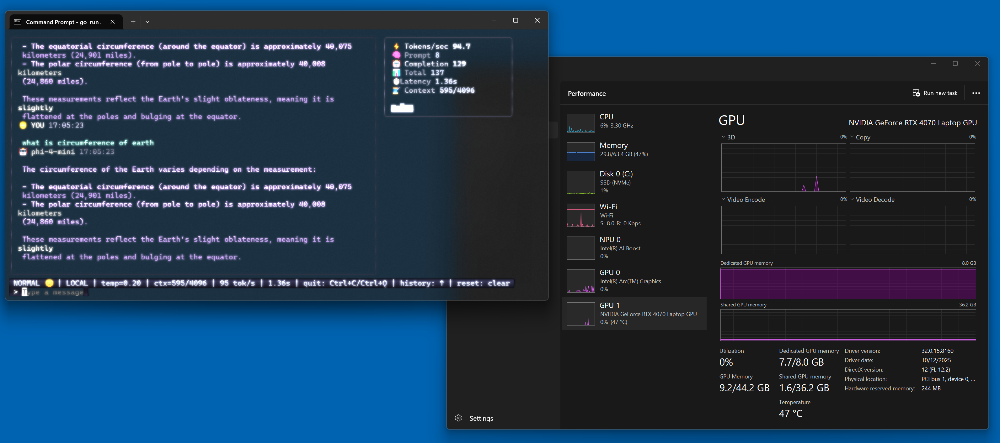
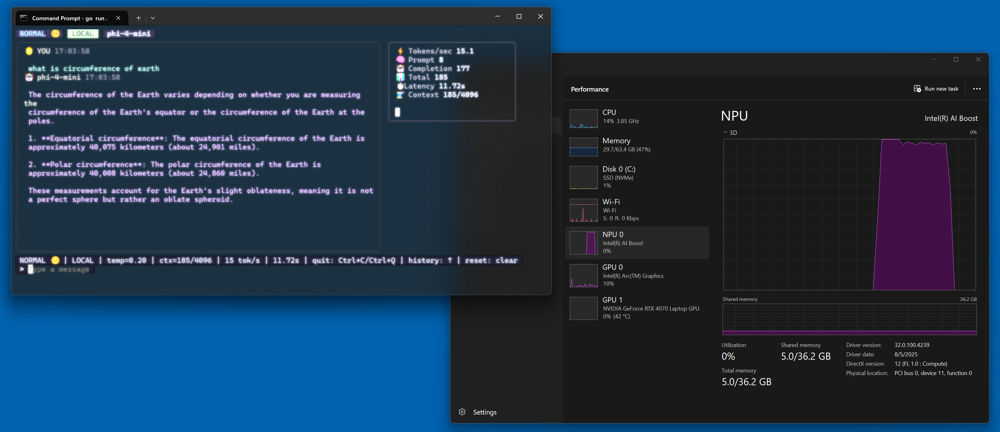

# 🧪 Foundry Local Sandbox

A **Golang terminal UI chat client** for talking to local AI models — powered by the [Microsoft Foundry Local SDK](https://github.com/microsoft/Foundry-Local) ported to Go. No cloud, no API keys, just your machine running models locally. 🚀





## ⚡ Quick Start

```sh
go run .
```

## 🎛 Startup Options

| Flag | Default | Description |
|------|---------|-------------|
| `-model` | `phi-4-mini` | Model alias or ID |
| `-system` | `"You are a helpful AI assistant."` | System prompt |
| `-device` | `auto` | Device: `auto` · `cpu` · `gpu` · `npu` |
| `-temp` | `0.2` | Sampling temperature (0–2) |
| `-ctx` | `4096` | Context window size |
| `-mode` | `local` | Session mode label (`local` · `remote`) |

## 🕹 In-App Shortcuts

| Key | Action |
|-----|--------|
| `↑` / `↓` | Scroll through prompt history |
| `:` | Enter command mode (`:clear`, `:temp`, `:model`, `:stats`, `:export`) |
| `clear` | Reset session & history |
| `q` / `quit` / `exit` | Quit |
| `Ctrl+C` / `Ctrl+Q` | Quit |

## 🛠 Built With

- [Bubble Tea](https://github.com/charmbracelet/bubbletea) — TUI framework
- [Lip Gloss](https://github.com/charmbracelet/lipgloss) — Styling
- [Foundry Local SDK](https://github.com/microsoft/foundry-local) — On-device AI inference
